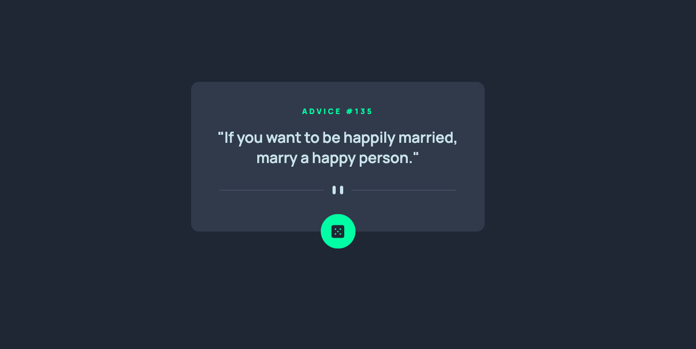

# Frontend Mentor - Advice generator app solution

This is a solution to the [Advice generator app challenge on Frontend Mentor](https://www.frontendmentor.io/challenges/advice-generator-app-QdUG-13db). Frontend Mentor challenges help you improve your coding skills by building realistic projects.

## Table of contents

- [Screenshot](#screenshot)
- [Links](#links)
- [Built with](#built-with)
- [Author](#author)

### Screenshot

### Links

- Live Site URL: [https://advice-generator-anaislcno.vercel.app/]

### Built with

- Semantic HTML5 markup
- CSS custom properties
- Flexbox
- [React](https://reactjs.org/) - JS library
- API

## Author

- Website - [Anais Lemire](https://anaislemire.vercel.app/)
- Frontend Mentor - [@anaislcno](https://www.frontendmentor.io/profile/anaislcno)
